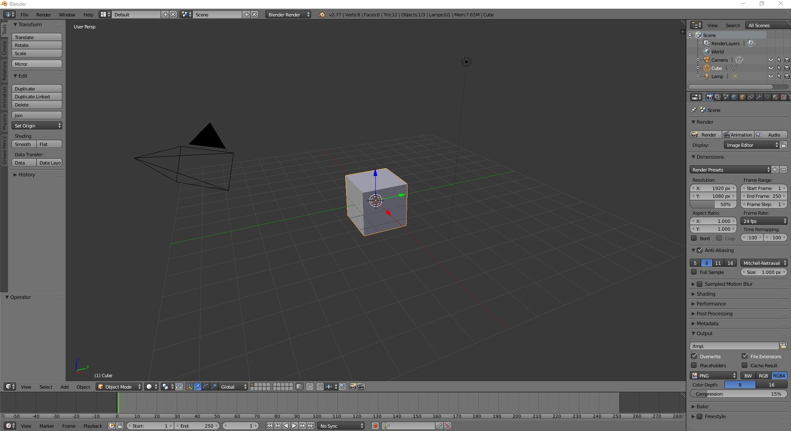
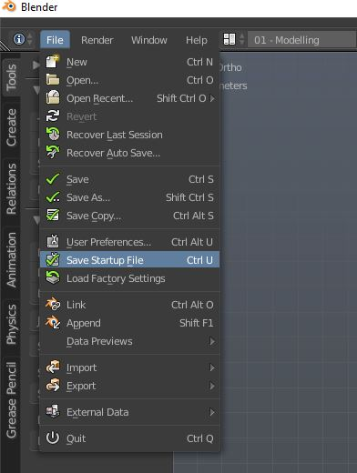
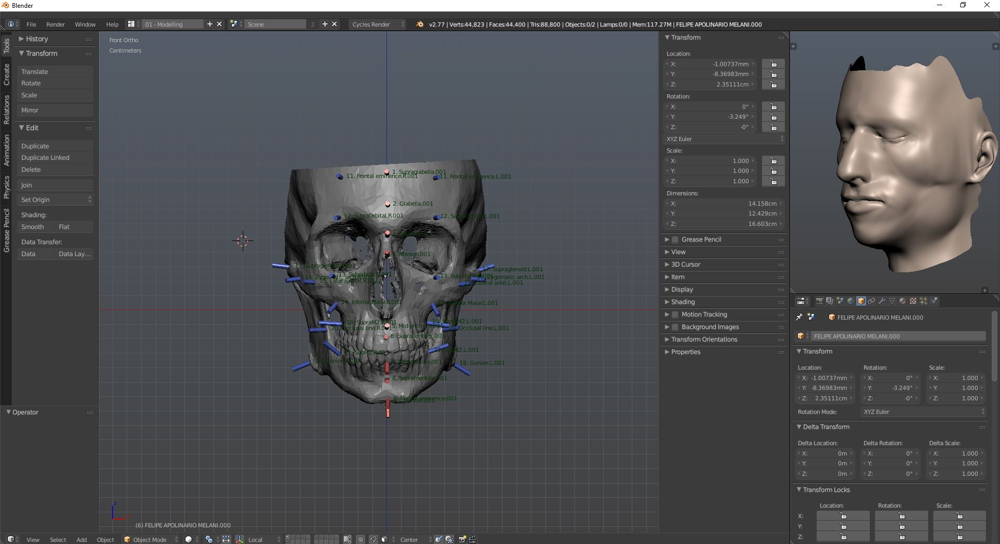
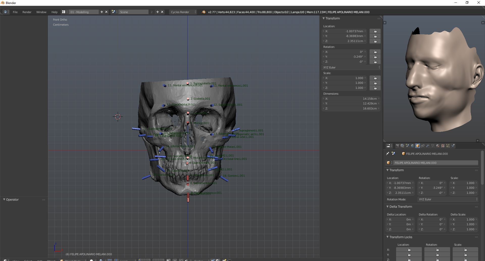
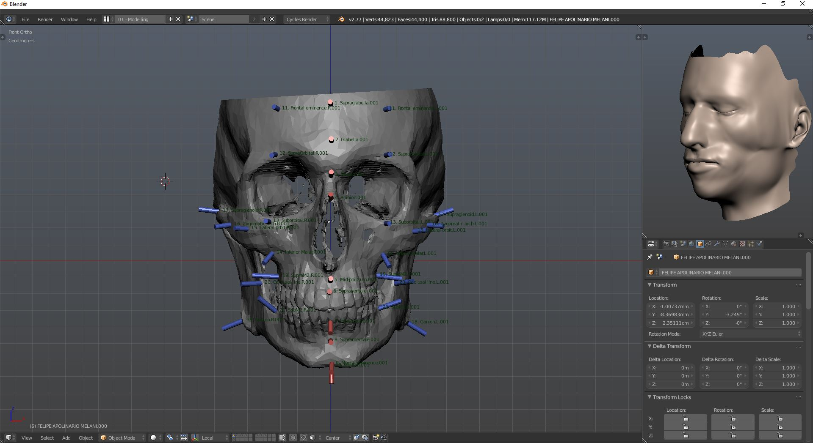

# Example

## Modifying basic interface and theme

When we first start up Blender, we have the following interface:



As an example for the startup modification on Blender, I'd manually modified the interface by choosing the theme colors, the position of workspace, the size and which angle I wanted it to visualize. All of this took less than a minute.

Right after, all I did was `Save Startup File`:



By doing so, everytime we open up Blender, the modified look will be loaded.

## Removing left and right panels properties

For a future update, we will need to remove some tools and add some buttons for the new UI on Blender. As a quick demonstration on how we would do it, we will remove panels of the Blender as a test.

As we know, Blender has load of buttons and options on the left and right toolbars (or panels), as we see here:



We want to remove the items inside the panels. So we write a Python code:

```python
import bpy
for pt in bpy.types.Panel.__subclasses__():
    if pt.bl_space_type == 'VIEW_3D':
        if "bl_rna" in pt.__dict__:   # <-- check if we already removed!
            bpy.utils.unregister_class(pt)
```

And save it under `...\scripts\startup` as `removepanel.py`. By doing so, everytime we run Blender, the scripts inside the folder will always be reloaded.



So if we close Blender and open it again, we will have the following:



